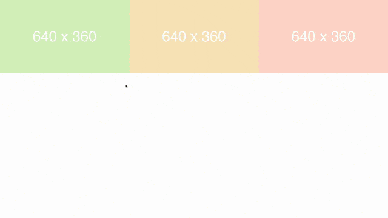

## modal.js
a lightbox plugin that loads up a higher resolution image from its thumbnail.

1. no jquery, prototype-based, event-driven, lightweight.
2. responsive.
3. only images are supported so far.
4. tested to work in chrome, safari, firefox.
5. animations are handled by `animate.css` by Daniel Eden.


## Demo


Demo link at http://htmlpreview.github.io/?https://github.com/simboonlong/modal.js/blob/master/index.html


## Usage
To use, initialize `modal.js` with the following arguments. The example uses a div with the id, "any-name".

```
var m = new Modal( document.getElementById('any-name'), options ); // set config
m.initialize();  // init modal
window.addEventListener('resize', onWindowResize.bind(m), false);

```

To create another set of gallery on the same html page, you can initialize another new Modal:

```
var m2 = new Modal( document.getElementById('any-name2'), options ); // set config
m2.initialize();  // init modal
window.addEventListener('resize', onWindowResize.bind(m2), false);

```

The high resolution images are to be keep in the folder named, "high-res", bearing the same naming convention as its thumbnails.


## Customizing
`modal.js` is used in conjunction with `animate.css` by Daniel Eden. To use various animations on the modalbox, simply change the option for `animationType` and `animationTime` accordingly:

```
var options = {
    animationType: 'fadeIn', // animate.css by Daniel Eden
    animationTime: 500 // will set and overwrite css timing in animate.css
};

```

View animate.css docs at this link http://daneden.github.io/animate.css/


## Issues
1. Not tested in IE yet.


## License
modal.js is licensed under the MIT license. (http://opensource.org/licenses/MIT)


## Contributing
Feel free to contribute.